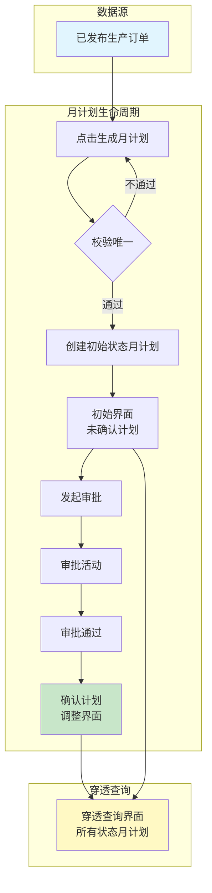
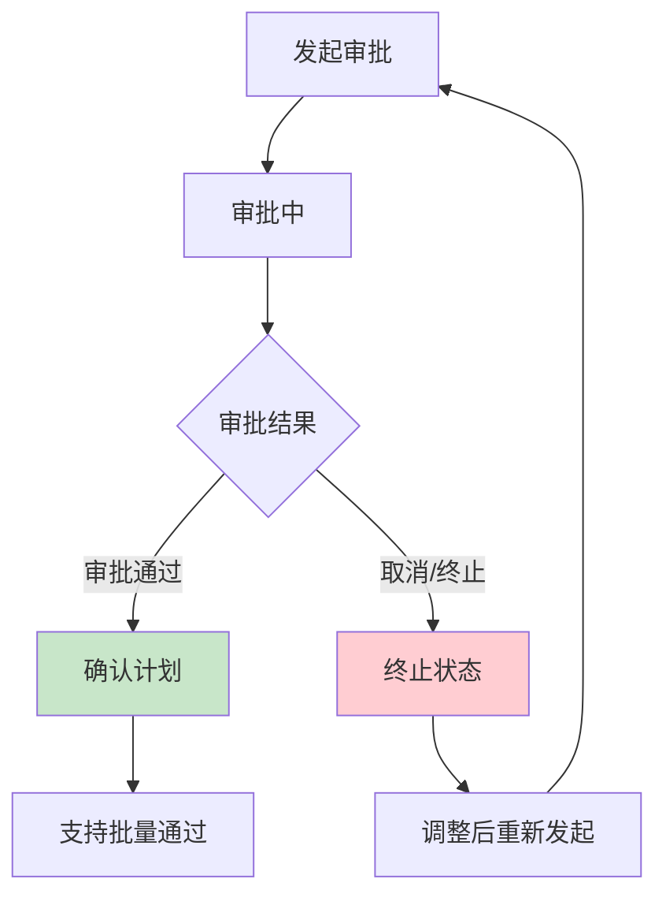
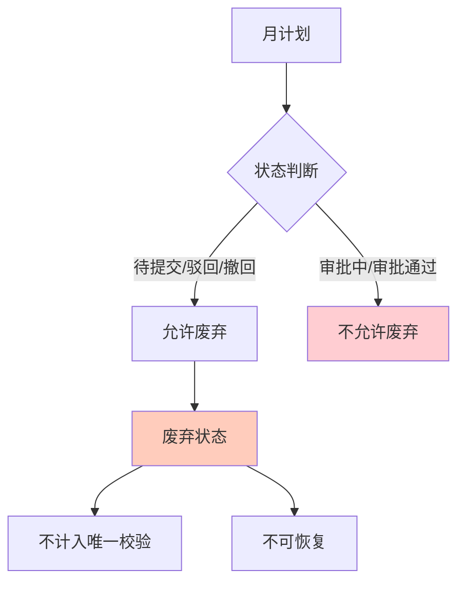
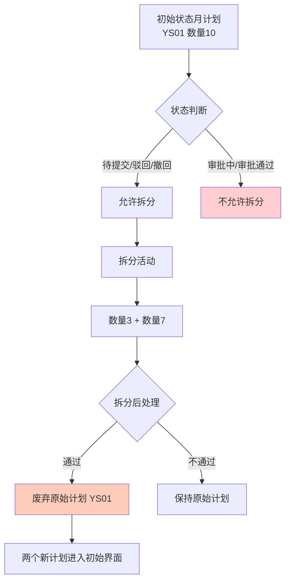
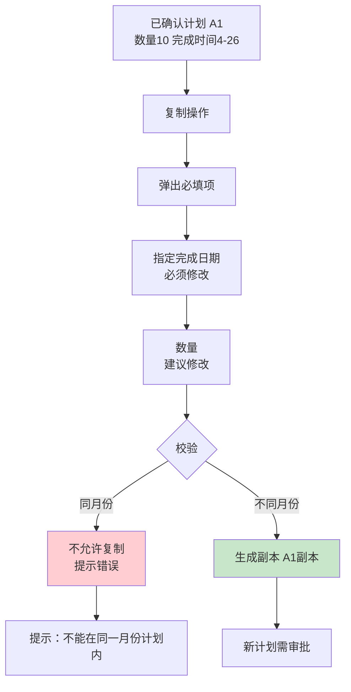
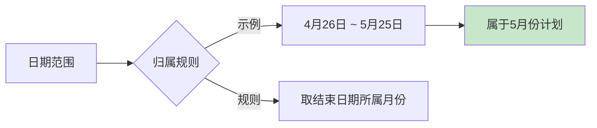
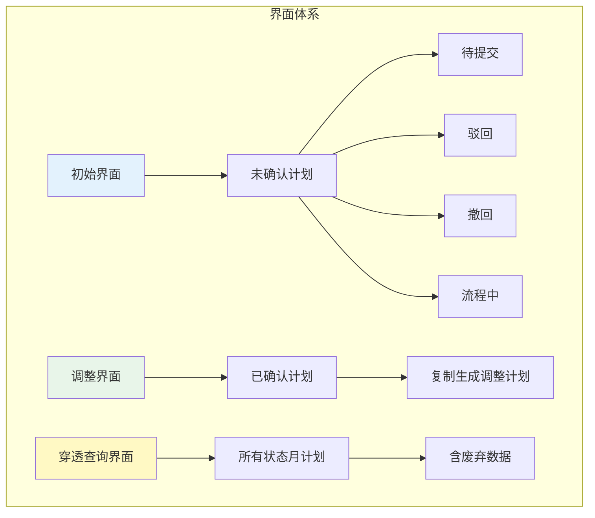
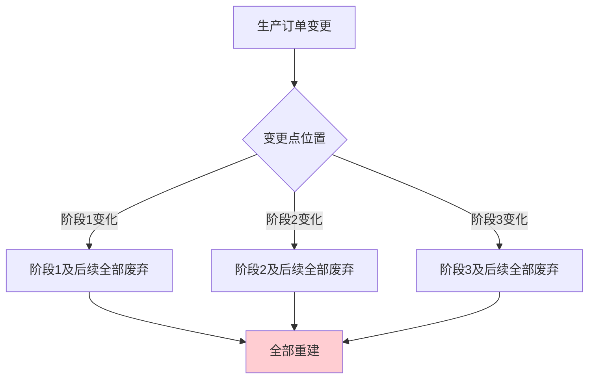

<!-- raw-to-wiki-ingest:auto -->

# 原始资料-项目文档-REQ-00040_月计划管理_梳理图及会议讨论整理

## 来源说明

- 原始路径：`wiki/02_HX项目资料/99_原始资料/bjhx_process/02_需求与方案/requirements/REQ-00040_月计划管理/process/REQ-00040_月计划管理_梳理图及会议讨论整理.md`
- 目标路径：`wiki/02_HX项目资料/99_原始资料镜像/bjhx_process/02_需求与方案/requirements/REQ-00040_月计划管理/process/REQ-00040_月计划管理_梳理图及会议讨论整理.md`
- 提取方式：`markdown`
- 说明：本页由统一入库脚本自动生成，不覆盖人工整理页。

## 原始内容镜像

## REQ-00040 月计划管理 — 梳理图及会议讨论整理

> 整理来源：月计划梳理图.png + 生产处月计划需求讨论v2.wav（文字版）
> 整理日期：2026-05-15
> 业务单元：生产处

***

### 一、业务术语统一

| 术语     | 说明                     |
| ------ | ---------------------- |
| 生产订单   | SAP 已发布的加工计划           |
| 月计划    | 从生产订单生成的月度执行计划         |
| 指定完成时间 | 月计划的计划完成日期（颗粒度：天）      |
| 初始界面   | 展示未确认计划（待提交/驳回/撤回/流程中） |
| 调整界面   | 展示已确认计划，支持复制生成调整计划     |
| 穿透查询   | 从生产订单查看关联的所有状态月计划      |

***

### 二、主业务流程

#### 2.1 校验唯一规则

- **校验维度**：SAP 订单号 + 工艺阶段 + 指定完成时间
- **颗粒度**：天（yyyy-MM-dd）
- **校验范围**：不考虑已废弃的月计划
- **记录来源**：月计划记录来源于生产订单 ID
- **校验逻辑**：生产订单 ID + SAP 订单号 + 工艺阶段 + 指定完成时间

***

### 三、审批活动子流程

#### 3.1 审批规则

| 规则    | 说明            |
| ----- | ------------- |
| 批量通过  | 支持批量审批通过      |
| 取消/终止 | 审批过程中可取消或终止   |
| 重新发起  | 终止后可调整并重新发起审批 |

***

### 四、废弃活动规则

#### 4.1 废弃规则

| 规则    | 说明               |
| ----- | ---------------- |
| 允许废弃  | 待提交、驳回、撤回状态的月计划  |
| 不允许废弃 | 审批中、审批通过的月计划     |
| 校验影响  | 废弃的月计划不计入唯一校验    |
| 恢复机制  | **废弃不可恢复**，需重新生成 |

#### 4.2 会议讨论要点

> **说话人A**：废弃就是废弃，不然玩不断的。我们要守住边界，不会在废弃状态和初始状态反复横跳。
>
> **说话人B**：随你，我们就讲新业务就行。我觉得没有问题。

***

### 五、拆分活动规则

#### 5.1 拆分规则

| 规则      | 说明                  |
| ------- | ------------------- |
| 拆分层级    | **只允许拆一级**，不允许嵌套拆分  |
| 允许拆分状态  | 待提交、驳回、撤回状态         |
| 不允许拆分状态 | 审批中、审批通过状态          |
| 原始计划处理  | 拆分通过后，**原始计划自动废弃**  |
| 新计划处理   | 拆分后的新计划进入初始界面，需重新审批 |
| 校验要求    | 拆分后的新计划需重新校验唯一性     |

#### 5.2 会议讨论要点

> **说话人A**：拆一级的时候也会有复制的问题吧？
>
> **说话人B**：没有。一级拆就完事了，没有复制这么一说。
>
> **说话人A**：那你原来的月计划怎么处理呢？
>
> **说话人B**：你拆了这个就不做计算了，这个原始的。
>
> **说话人A**：那他的状态自动废弃掉。拆之后，假设我校验已经通过了，我拆的时候校验通过了，我一想也应该是废。你不废就玩不转了。

***

### 六、复制/调整规则（审批通过后）

#### 6.1 复制规则

| 规则    | 说明                   |
| ----- | -------------------- |
| 复制前提  | 仅审批通过的月计划允许复制        |
| 复制数量  | **只能复制一份**           |
| 必填项   | 复制时必须指定新的完成日期        |
| 数量修改  | 建议修改数量（原数量10 → 新数量5） |
| 月份限制  | **不能在同一月份计划内复制**     |
| 新计划状态 | 生成的副本需重新走审批流程        |
| 原计划状态 | 原审批通过计划保持不变          |

#### 6.2 会议讨论要点

> **说话人B**：假如他的计划数量是10，没干完，他说我要生成个副本，我要改成5月26号干完，这个时候数量给个5，他保持不动，新生成一个，他需要审批。
>
> **说话人A**：那他这个属不属于拆分的业务活动？
>
> **说话人B**：不属于拆分，他没有拆。他没有变，他源头没有变化。
>
> **说话人A**：复制的时候我就提示，他只要一点复制，我让他弹出一个框选日期。必须给个新的完成日期，而且不能是一个月份计划内。

***

### 七、月份归属规则

#### 7.1 归属规则

| 规则   | 说明                           |
| ---- | ---------------------------- |
| 归属方式 | 取日期范围的**结束日期**所属月份           |
| 示例   | 4月26日 \~ 5月25日 → **属于5月份计划** |
| 业务场景 | 企业自定义月度周期（非自然月）              |

#### 7.2 会议讨论要点

> **说话人A**：所属月份是按开头还是按结尾？假如说4月25到5月26，它的月份是属于4月还是5月？
>
> **说话人B**：应该是4月26到5月25。
>
> **说话人A**：这是5月份计划，对吧？就是取后头的，理论上是吧？
>
> **说话人B**：对。

***

### 八、界面划分

#### 8.1 界面说明

| 界面     | 功能        | 数据范围            |
| ------ | --------- | --------------- |
| 初始界面   | 管理未确认计划   | 待提交、驳回、撤回、流程中   |
| 调整界面   | 管理已确认计划   | 审批通过，支持复制生成调整计划 |
| 穿透查询界面 | 从生产订单穿透查询 | 所有状态（含废弃）       |

#### 8.2 会议讨论要点

> **说话人A**：至少我收集到了有3个界面，一个初始就是未确认的计划。然后你这里又是确认后的计划。那你穿透呢？你不是要穿所有的吗？所有状态的吗？
>
> **说话人B**：你穿透要单独做个界面。
>
> **说话人A**：或者只是那个界面，我到时候再想一想。对界面这块没多大要求，是吧？
>
> **说话人B**：不是我们的，能符合要求就行。

***

### 九、生产订单变更规则

#### 9.1 变更规则

| 规则    | 说明                   |
| ----- | -------------------- |
| 变更触发  | 生产订单阶段发生变化（新增/修改/删除） |
| 影响范围  | 变更点及后续所有阶段全部废弃       |
| 重建方式  | 全部废弃后重新生成            |
| 已开工处理 | 已开工的数据也废弃（造废不误）      |

#### 9.2 会议讨论要点

> **说话人B**：从现在涉及的变更，如果说这个阶段有变化，那这个基本上我们现在的逻辑是全部废掉。重建。只要这个点有变化，这个阶段有变化，无论是新增是修改、是删除，只要它变对应的报工也好，对应的月计划也好，所有的所有全部废掉。
>
> **说话人A**：全废掉，重干。那他已经开工了嘞？
>
> **说话人B**：他是按点来算的。你比方说1-2-3-4-5-6，你的变更点在1，1到后面的全部废。2有变化，2到后面的全部废。
>
> **说话人A**：也废掉。造废不误。你到时候统计工时咋整呢？
>
> **说话人B**：所以说这一块很麻烦，我们虽然说现在是聊的是造废不误，但是还没有...

***

### 十、关键业务规则汇总

| 规则类别   | 规则内容                  | 来源     |
| ------ | --------------------- | ------ |
| 校验唯一   | SAP订单号+工艺阶段+指定完成时间（天） | 梳理图+会议 |
| 废弃限制   | 审批中/审批通过的不能废弃         | 梳理图+会议 |
| 废弃恢复   | 废弃不可恢复，需重新生成          | 会议讨论   |
| 拆分层级   | 只允许拆一级，不允许嵌套拆分        | 梳理图+会议 |
| 拆分后处理  | 原始计划自动废弃              | 会议讨论   |
| 复制限制   | 只能复制一份，必须修改完成日期       | 梳理图+会议 |
| 复制月份限制 | 不能在同一月份计划内复制          | 会议讨论   |
| 月份归属   | 取结束日期所属月份             | 会议讨论   |
| 变更处理   | 变更点及后续全部废弃重建          | 会议讨论   |
| 发布后调整  | 发布后不允许调整指定完成时间        | 梳理图+会议 |

***

### 十一、待澄清问题（与待澄清清单对应）

| 问题编号 | 问题描述            | 会议讨论状态              |
| ---- | --------------- | ------------------- |
| 问题1  | 指定完成时间的校验粒度     | **已确认：按天**          |
| 问题2  | 生产订单调整后的重复生成    | 部分确认：发布后不允许调整       |
| 问题3  | 初始界面与调整界面的定义    | **已确认：两个界面+穿透查询界面** |
| 问题4  | 已废弃数据的显示规则      | 穿透查询需显示所有状态         |
| 问题5  | 月计划拆分的层级限制      | **已确认：只拆一级，不允许嵌套**  |
| 问题6  | 已通过状态的月计划是否允许拆分 | **已确认：不允许拆分，只能复制**  |
| 问题7  | 月度计划的日期边界定义     | **已确认：取结束日期所属月份**   |
| 问题8  | 调整拆分后的数据回流规则    | 拆分后新计划进入初始界面        |

***

### 十二、原始材料索引

| 文件名                 | 类型 | 说明             |
| ------------------- | -- | -------------- |
| 月计划梳理图.png          | 图片 | 月计划管理业务流程梳理图   |
| 生产处月计划需求讨论v2.wav    | 音频 | 生产处月计划需求讨论会议录音 |
| 生产处月计划需求讨论文字版v2.txt | 文本 | 会议录音文字转写稿      |
