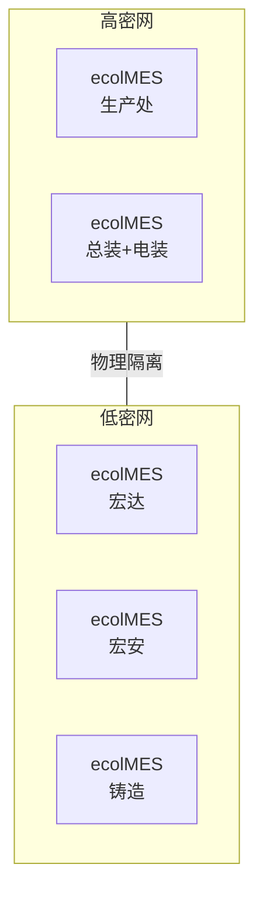
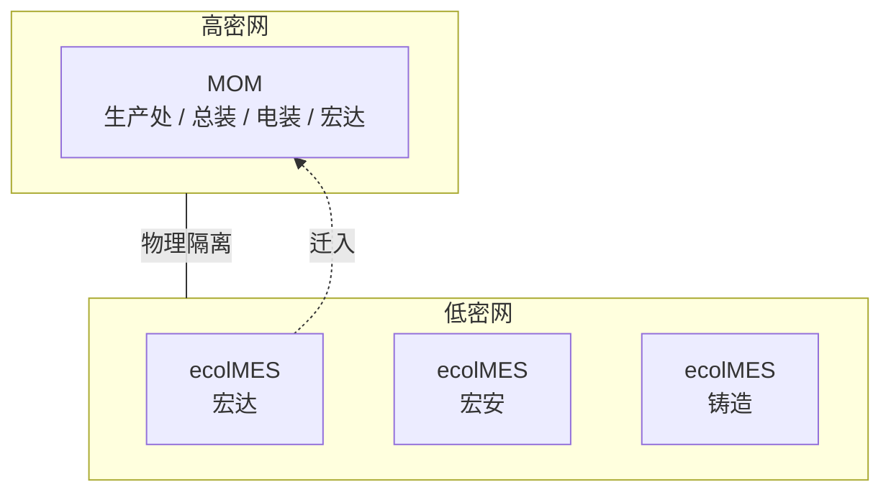
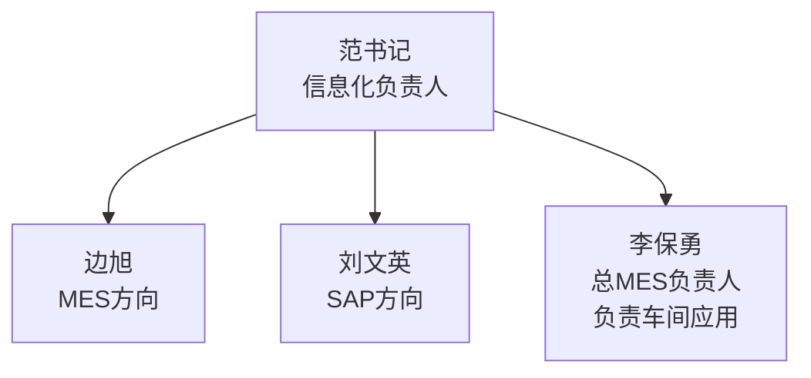

<!-- raw-to-wiki-ingest:auto -->

# 原始资料-项目文档-项目概况

## 来源说明

- 原始路径：`wiki/02_HX项目资料/99_原始资料/bjhx_process/项目概况.md`
- 目标路径：`wiki/02_HX项目资料/99_原始资料镜像/bjhx_process/项目概况.md`
- 提取方式：`markdown`
- 说明：本页由统一入库脚本自动生成，不覆盖人工整理页。

## 原始内容镜像

## HX 项目概况

- 合同号：2409009

### 项目定位

HX 项目是将客户现有的 ecolMES 系统迁移至新的 MOM 制造运营管理平台。

### 现有系统情况

- 客户当前部署了**5套 ecolMES**，分别服务于不同业务场景
- ecolMES 为**单体架构**，各套系统独立运行
- 客户现场分为**高密网**和**低密网**两个网络区域，安全等级不同，两网之间物理隔离

#### ecolMES 部署结构

| 网络区域 | ecolMES 实例 | 说明               |
| -------- | ------------ | ------------------ |
| 高密网   | 生产处       |                    |
| 高密网   | 总装+电装    | 总装与电装共用一套 |
| 低密网   | 宏达         |                    |
| 低密网   | 宏安         |                    |
| 低密网   | 铸造         |                    |

#### 现状架构

### 目标系统

- **MOM 制造运营管理平台**
- 采用**微服务架构**，前后端分离设计
- MOM 支持**多工厂多组织**，可在一套系统中承载多个业务单元
- **部署环境**：麒麟 V10SP3 / 纯内网 / 物理部署（非容器化）
- **客户**：北京HX

#### 迁移目标

| 网络区域 | 迁移后系统          | 覆盖业务单元             | 说明                                                    |
| -------- | ------------------- | ------------------------ | ------------------------------------------------------- |
| 高密网   | MOM（1套）          | 生产处、总装、电装、宏达 | 原高密网2套ecolMES + 宏达由低密网迁入，统一由1套MOM承载 |
| 低密网   | ecolMES（保持现状） | 宏安、铸造               | 不迁移，继续使用ecolMES                                 |

#### 目标架构

### 客户信息化组织

| 姓名   | 部门     | 角色           | 职责                 | 与本项目关系 |
| ------ | -------- | -------------- | -------------------- | ------------ |
| 范书记 | 信息化部 | 信息化负责人   | 信息化部门统筹管理   | 决策层       |
| 边旭   | 信息化部 | 信息化         | MES 方向             | 主要对接人   |
| 刘文英 | 信息化部 | 信息化         | SAP 方向             | 集成相关     |
| 李保勇 | 信息化部 | 总MES负责人    | 车间应用（今年负责） | 主要对接人   |
| 李明   | 生产处   |                |                      | 业务对接人   |
